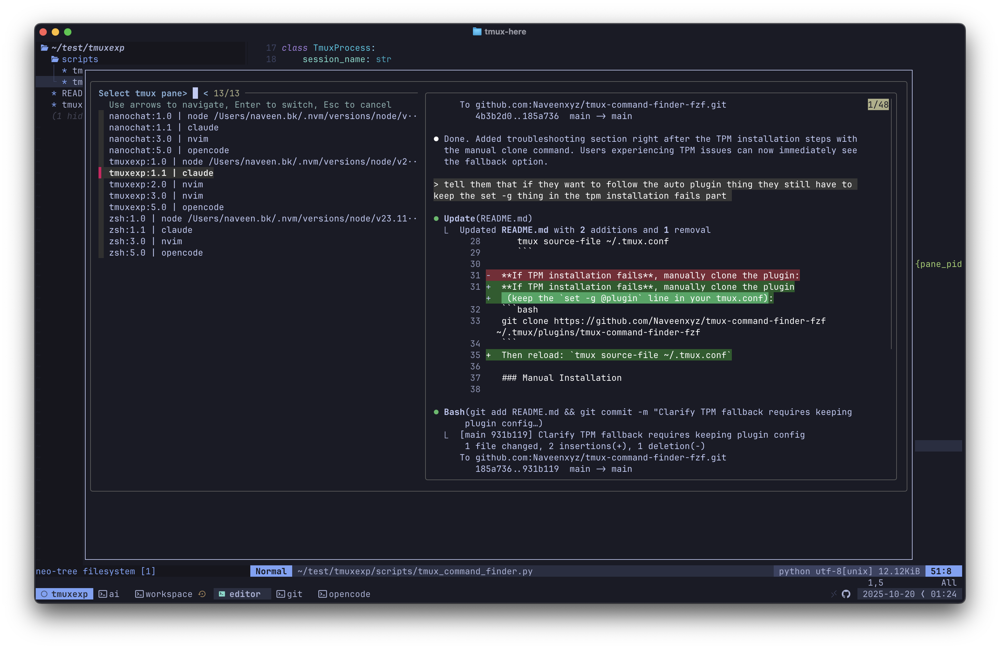

# Tmux Command Finder

A tmux plugin to detect and manage running commands across sessions with a fuzzy finder interface.



## Features

- 🔍 Detects running commands across all tmux sessions and panes
- 🌳 Parses command line arguments to identify actual commands (handles node/codex/claude correctly)
- 🎯 Interactive fuzzy finder with live preview of pane content
- ⚡ Quick switching to selected command's session/pane with keyboard shortcut
- ⚙️  Configurable target commands and keybinding

## Installation

### Using TPM (recommended)

1. Add plugin to your `~/.tmux.conf`:

```bash
set -g @plugin 'Naveenxyz/tmux-command-finder-fzf'
```

2. Install with TPM:
   - Press `prefix + I` to fetch and install the plugin

3. Reload tmux environment:
   ```bash
   tmux source-file ~/.tmux.conf
   ```

**If TPM installation fails**, manually clone the plugin (keep the `set -g @plugin` line in your tmux.conf):
```bash
git clone https://github.com/Naveenxyz/tmux-command-finder-fzf ~/.tmux/plugins/tmux-command-finder-fzf
```
Then reload: `tmux source-file ~/.tmux.conf`

### Manual Installation

1. Clone this repository:
   ```bash
   git clone https://github.com/Naveenxyz/tmux-command-finder-fzf ~/.tmux/plugins/tmux-command-finder-fzf
   ```

2. Add to `~/.tmux.conf`:
   ```bash
   run-shell ~/.tmux/plugins/tmux-command-finder-fzf/tmux-command-finder.tmux
   ```

3. Reload tmux config:
   ```bash
   tmux source-file ~/.tmux.conf
   ```

## Usage

### Interactive Mode (Default)

Inside tmux, press: **prefix + Ctrl-f**

This opens a popup with:
- List of all detected commands
- Live preview of pane output on the right
- Arrow keys to navigate
- Enter to switch to selected pane
- Esc to cancel

### Command Line Usage

You can also run the finder directly from your shell:

```bash
# Interactive mode
~/.tmux/plugins/tmux-command-finder-fzf/scripts/tmux-find

# List all detected commands
~/.tmux/plugins/tmux-command-finder-fzf/scripts/tmux-find --list

# List in JSON format
~/.tmux/plugins/tmux-command-finder-fzf/scripts/tmux-find --list --json

# Specify custom target commands
~/.tmux/plugins/tmux-command-finder-fzf/scripts/tmux-find --commands codex claude npm python
```

## Configuration

### Custom Keybinding

Change the default keybinding (Ctrl-f) by adding to your `~/.tmux.conf`:

```bash
set -g @tmux-command-finder-key 'C-g'  # Use Ctrl-g instead
```

### Custom Target Commands

Override the default target commands by adding to your `~/.tmux.conf`:

```bash
# Example: Find specific dev tools
set -g @tmux-command-finder-commands 'codex claude opencode npm yarn nvim'

# Or customize for your workflow
set -g @tmux-command-finder-commands 'npm yarn python docker kubectl'
```

If not set, uses these defaults:
- **Dev Tools**: codex, claude, opencode
- **Package Managers**: npm, yarn, pnpm
- **Languages**: python, node, ruby, php
- **Build Tools**: cargo, go, java, mvn, gradle
- **DevOps**: docker, kubectl

You can also pass `--commands` when running directly from command line to temporarily override.

## How it Works

1. **Session Discovery**: Scans all tmux sessions, windows, and panes
2. **Command Line Parsing**: Reads full command line arguments (e.g., `node /path/to/bin/codex` → `codex`)
3. **Process Tree Walking**: For shell processes, walks the tree to find actual running commands
4. **Command Matching**: Matches against configurable target commands
5. **Interactive Selection**: Uses fzf for fuzzy searching with live preview
6. **Session Switching**: Automatically switches to the selected session/pane

## Requirements

- tmux 3.0+
- Python 3.6+
- fzf - `brew install fzf` (macOS) or `apt install fzf` (Linux)

## Examples

### Finding specific commands

```bash
# Find all Node.js-based dev tools
tmux-find --commands codex claude opencode

# Find all build processes
tmux-find --commands npm yarn cargo gradle --list

# Interactive mode with custom commands
tmux-find --commands python node docker
```

## Troubleshooting

### "No target commands found"
- Make sure the commands are actually running in tmux panes
- Try listing all commands to see what's detected
- Check if your command is in the default list, or specify with `--commands`

### Preview not working
- Ensure fzf is installed: `brew install fzf`
- Check tmux version: `tmux -V` (needs 3.0+)
- Verify popup support is available

### Keybinding not working
- Verify tmux.conf was sourced: `tmux source-file ~/.tmux.conf`
- Check your prefix key (default is Ctrl-b)
- Try the default: prefix + Ctrl-f

### Command shows as "node" instead of actual command
- This should be fixed automatically through process tree walking
- If still having issues, please file a bug report

## Uninstall

### Using TPM

1. Remove the plugin line from `~/.tmux.conf`:
   ```bash
   # Remove this line:
   set -g @plugin 'Naveenxyz/tmux-command-finder-fzf'
   ```

2. Press `prefix + alt + u` to uninstall the plugin

### Manual

```bash
# Remove the plugin directory
rm -rf ~/.tmux/plugins/tmux-command-finder-fzf

# Remove from tmux.conf
# Edit ~/.tmux.conf and remove the run-shell line
```

## License

MIT

## Contributing

Contributions welcome! Please feel free to submit a Pull Request.
